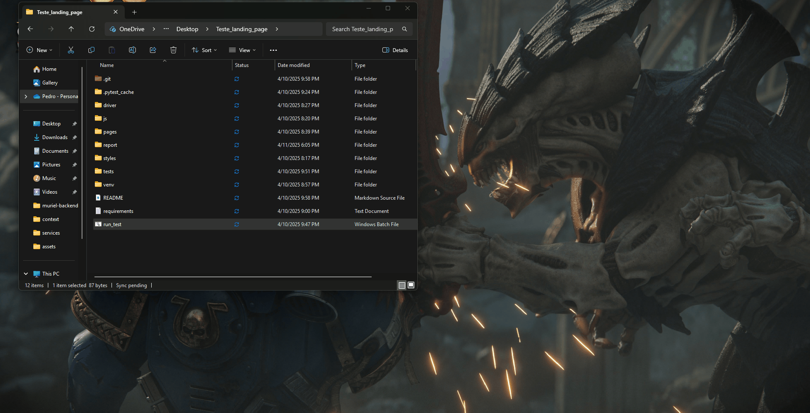

# 🚀 Teste Landing Page

A simple and clean landing page project built for testing and demonstration purposes. It includes a responsive design, modern UI, and test automation to ensure everything works as expected.

---

## 🛠️ Technologies Used

- **HTML5** & **CSS3** – Markup and styling
- **JavaScript (ES6)** – Interactivity and logic
- **Git** – Version control
- **GitHub** – Repository hosting
- **VS Code** – Main code editor
- **npm** – Package management (optional if using automation or frameworks)
- **Testing Tool** – (e.g., Cypress, Playwright, Jest) for automated UI testing
- **ScreenToGif** – To record and create the demo GIF

---
